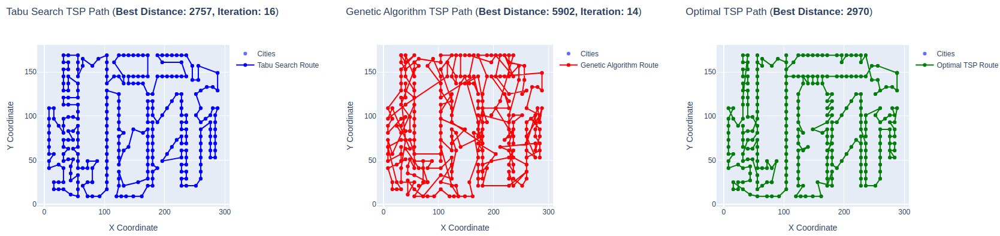

# Traveling Salesman Problem (TSP) Comparison

## TSP - The Problem
The Traveling Salesman Problem (TSP) is a classic optimization problem where the goal is to find the shortest possible route that visits a set of cities exactly once and returns to the origin city. It is a well-known NP-hard problem in combinatorial optimization, important in theoretical computer science and operations research.

## Tabu Search
### Method
Tabu Search is a metaheuristic search method that guides a local heuristic search procedure to explore the solution space beyond local optimality. It uses memory structures that describe the visited solutions or user-provided rules to escape local optima.

### Implementation
The implementation of Tabu Search in this project is found in the `tsp_solver.cpp` file. The key parameters include:
- **Tabu Tenure**: The number of iterations a move remains in the tabu list.
- **Max Iterations**: The maximum number of iterations to perform.
- **Neighborhood Size**: The size of the neighborhood to explore.
- **Neighborhood Structure**: The type of neighborhood moves (e.g., 2-opt, 3-opt, shuffle).

The `TabuSearchSolver` class handles the Tabu Search algorithm, and the results are processed and visualized in the Dash application.

#### Neighborhood Structures
- **2-opt Moves**: This involves selecting two edges and reversing the order of the cities between these edges to create a new route.
- **3-opt Moves**: This involves selecting three edges and rearranging the cities between these edges in a different order to create a new route.
- **Shuffle Subtour**: This involves selecting a subset of cities and shuffling their order randomly to create a new route.

## Genetic Algorithm
### Method
Genetic Algorithms (GAs) are adaptive heuristic search algorithms based on the evolutionary ideas of natural selection and genetics. They are used to find approximate solutions to optimization and search problems.

### Implementation
The implementation of the Genetic Algorithm in this project is found in the `tsp_solver.cpp` file. The key parameters include:
- **Population Size**: The number of individuals in the population.
- **Mutation Rate**: The probability of mutation occurring in an individual.
- **Generations**: The number of generations to evolve.
- **Crossover Operator**: The method used to combine two parents to produce offspring (e.g., PMX, OX).
- **Selection Operator**: The method used to select parents for reproduction (e.g., tournament, random).
- **Mutation Operator**: The method used to mutate individuals (e.g., swap, scramble).

The `GeneticAlgorithmSolver` class handles the Genetic Algorithm, and the results are processed and visualized in the Dash application.

#### Crossover Operators
- **PMX (Partially Mapped Crossover)**: This operator exchanges segments between two parents and maps the remaining cities to maintain valid routes.
- **OX (Order Crossover)**: This operator preserves the relative order of cities from the parents while creating offspring.

#### Selection Operators
- **Tournament Selection**: This method selects parents by running several "tournaments" among a few individuals chosen at random from the population.
- **Random Selection**: This method selects parents randomly from the population.

#### Mutation Operators
- **Swap Mutation**: This involves selecting two cities in the route and swapping their positions.
- **Scramble Mutation**: This involves selecting a subset of cities and shuffling their order randomly.

## Dash
Dash is a productive Python framework for building web applications. It is used in this project to create an interactive web interface for comparing the performance of the Tabu Search and Genetic Algorithm on the TSP. The `app.py` file sets up the Dash application, and the `ui.py` file defines the layout and user interface components.

## Screenshots

The UI written in Dash (inputs are Tabu Tenure, Max Iterations, Neighborhood Size and Neighborhood Structure for Tabu Search)

(Population size, mutation rate, generations, crossover operator, selection operator, mutation operator)

Cities Graph: Displays all the cities in the TSP problem as points on a 2D plane.

TS, GA, Shows the best path found by Tabu Search, GA, Optimal results: and the "optimal" path computed using Christofides method.

Convergence Graph: Compares the convergence of Tabu Search and Genetic Algorithm on the current iteration.

Convergence Graph: Compares the convergence of Tabu Search and Genetic Algorithm over iterations.

Distance Distribution Histogram: Shows the distribution of best distances found by both algorithms.

Box Plot: Compares the distribution of best distances using box plots.

Box Plot: Distributions for Tabu Search.

Box Plot: Distributions for Genetic Algorithm.

Scatter Plot: Compares execution time for the current iteration GA vs TS.

Heat Map: Distance Matrix visualized.

Current found solution.

Tabu Search tabel of iteration to compare results.

Genetic Algorithm tabel of iteration to compare results.

Best Results Table: Displays the best results for both algorithms.